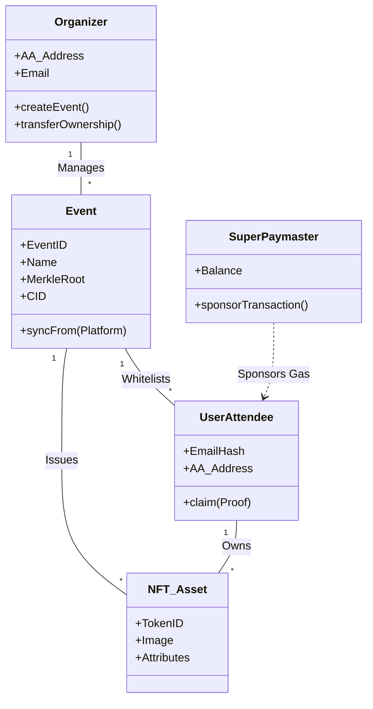
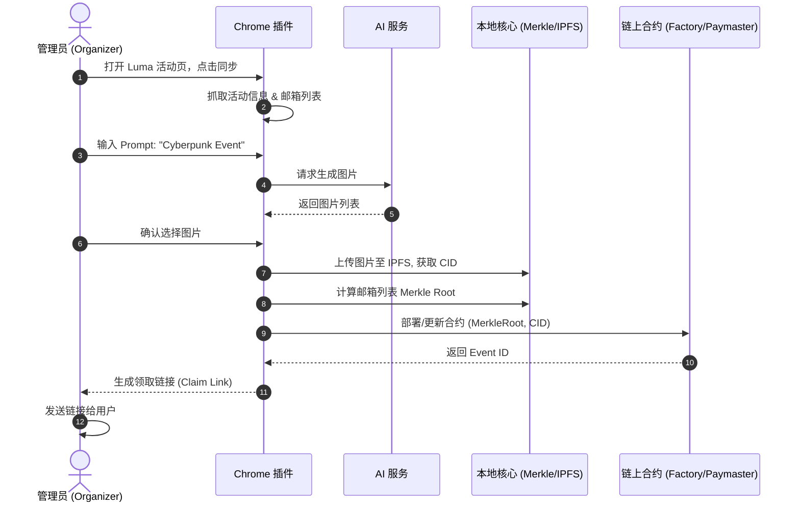

# OpenEvent NFT (OEN) 产品设计文档

## 1. 系统核心模块 (Core Modules)

本系统采用 **“混合式本地化架构 (Hybrid Local-First)”**，核心逻辑运行在客户端（Chrome 插件），数据存储在去中心化网络，计算在本地，交互在链上。

### 1.1 插件前端与交互模块 (Extension Client)
*   **活动数据抓取器 (Event Scraper)**: 自动检测 Luma, Devfolio 等活动页面，通过 DOM 注入提取活动信息（标题、时间、封面）及报名者名单（Email/Wallet）。
*   **轻量级钱包管理器 (Light Wallet Manager)**: 管理用户的 AA 账户（基于 Email/Passkey 生成），处理签名请求，支持与 MetaMask/WalletConnect 的交互。
*   **AI 创作控制台 (AI Studio)**: 提供 Prompt 输入界面，调用本地或云端 AI API 生成 NFT 图像，支持预览和选择。

### 1.2 本地核心服务模块 (Local Core Service)
*   **隐私与加密引擎 (Privacy Engine)**: 在本地将白名单（Email/Address）计算为 Merkle Tree，仅生成 Merkle Root 上链，保护用户隐私。
*   **分布式存储连接器 (Storage Connector)**: 负责将生成的 NFT 图像和 Metadata 上传至 IPFS 或 Arweave，获取 CID。
*   **数据备份与导出 (Data Vault)**: 将活动数据、原始名单、Merkle Proofs 打包为加密 JSON，供管理员本地备份。

### 1.3 链上合约体系 (On-Chain Contracts)
*   **OEN Factory**: 负责部署活动专属的 NFT Collection 合约。
*   **AA Wallet Factory**: 基于 ERC-4337 标准，为每个 Email 用户生成智能合约账户。
*   **SuperPaymaster**: 核心支付网关，负责代付用户领取 NFT 时的 Gas 费用。
*   **Registry**: 全局注册表，索引所有通过 OEN 发行的活动和资产，供 MySBT 等身份协议查询。

---

## 2. 核心业务对象分析 (Core Business Objects)

### 2.1 Event (活动)
*   **定义**: 对应现实世界或网络上的一次聚会、黑客松或 AMA。
*   **属性**: 
    *   `EventID`: 唯一标识符。
    *   `SourceURL`: 来源平台链接 (Luma/Devfolio)。
    *   `MerkleRoot`: 白名单的链上根哈希。
    *   `MetadataCID`: 描述活动的 IPFS 哈希。
    *   `Organizer`: 管理员的 AA 或 EOA 地址。

### 2.2 User Identity (用户身份)
*   **定义**: 参与者或组织者在系统中的映射。
*   **属性**:
    *   `EmailHash`: 邮箱的哈希值（隐私标识）。
    *   `AA_Address`: 智能合约钱包地址 (Counterfactual Address)。
    *   `OwnerKey`: 控制权密钥 (Passkey / EOA)。
    *   `RecoveryGuardians`: 社交恢复守护人列表。

### 2.3 NFT Asset (数字资产)
*   **定义**: 证明参与权的 Token (ERC-1155 或 ERC-721)。
*   **属性**:
    *   `TokenID`: 资产编号。
    *   `ImageURL`: AI 生成的图片链接。
    *   `Attributes`: 符合 POAP 标准的属性 (City, Date, EventType)。
    *   `IsSBT`: 是否不可转移 (Soulbound)。

### 2.4 Claim Proof (领取凭证)
*   **定义**: 验证用户有资格领取 NFT 的数据包。
*   **属性**:
    *   `Proof`: Merkle Proof 数组。
    *   `Recipient`: 接收者地址。
    *   `Status`: 领取状态 (Pending/Claimed)。

---

## 3. 核心用户交互场景 (Core User Interaction Scenarios)

### 3.1 社区管理员：从活动同步到发行 (Organizer Flow)
1.  **启动与同步**: 管理员在 Chrome 浏览器打开 Luma 活动管理页，点击 OEN 插件图标。插件自动识别并抓取 "Web3 Hacker House" 活动信息及 150 个报名邮箱。
2.  **AI 创作**: 在插件弹窗中，管理员输入 "Cyberpunk coding vibe"，选择 "Pixel Art" 风格。插件调用 AI 生成 4 张图，管理员选中一张作为 NFT 封面。
3.  **部署与上链**: 点击 "Deploy"。插件在本地计算 Merkle Tree，调用 SuperPaymaster 支付 Gas，将 Merkle Root 和 IPFS Metadata 上链。
4.  **分发**: 插件生成通用的 Claim Link（包含活动 ID），或者通过邮件 API 向 150 个邮箱发送专属领取链接。

### 3.2 普通用户：无感领取 (Attendee Flow)
1.  **访问链接**: 用户收到邮件或扫描现场二维码，打开领取页面。
2.  **身份验证**: 用户输入邮箱登录（或使用 Google Social Login）。
3.  **自动领取**: 系统后端验证邮箱是否在 Merkle Tree 白名单中。
    *   **若验证通过**: 系统计算 AA 钱包地址，通过 Paymaster 代付 Gas，直接 Mint NFT 到该 AA 账户。
4.  **查看资产**: 页面展示 "Claimed Successfully"，并显示 NFT 卡片。用户后续可绑定 EOA 钱包转移资产，或直接作为 SBT 展示。

---

## 4. 管理员快速上手指南 (Quick Start Guide)

**欢迎使用 OpenEvent NFT (OEN)！** 
OEN 是您的 Web3 社区声誉发行助手，只需 3 步即可将任何线下活动转化为链上资产，且无需用户支付 Gas。

**如何开始？**
1.  **安装插件**: 添加 OEN Chrome 扩展程序，使用 Google 账号一键登录初始化您的管理账户。
2.  **一键同步**: 打开您的活动平台（如 Luma, Devfolio），点击插件图标，选择 **"Sync Event"**。系统会自动提取活动信息和报名名单。
3.  **AI 发行**: 输入一句描述（如“清迈泼水节聚会”），AI 自动为您生成精美 NFT 图片。点击 **"Publish"**，分享生成的领取链接给您的社区成员即可。

**亮点功能**: 
*   **零成本**: 您的用户无需钱包、无需 ETH 即可领取。
*   **隐私保护**: 名单本地加密，链上无明文数据。
*   **多签治理**: 支持后续将管理权限移交给社区多签钱包。

---

## 5. 系统图示 (Diagrams)

### 5.1 核心业务对象关系图 (Class Diagram)

### 5.2 组织者发行流程图 (Sequence Diagram)

